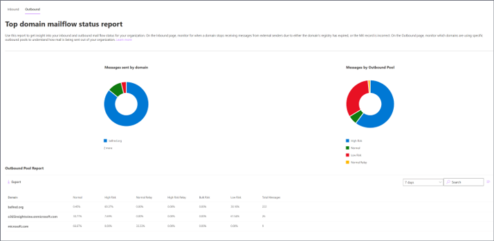

# Top domain mailflow status report in the new Exchange admin center in Exchange Online

The Top domain mailflow status report in the new EAC contains two tabs providing insight into your inbound and outbound mail flow status for your organization. You can find this report at Reports > Mail Flow in the new EAC.

- On the **Inbound** page, you can find information on whether your email domains are receiving external messages or not. Typically, these types of issues are related to MX record problems or an expired domain.

- On the **Outbound** page, the report gives you insights into your outbound mail flow, for example which outbound pools are being used to send mail out of your organization.

> [!NOTE]
> For permissions that are required to use this report, see [Permissions required to view mail flow reports](mail-flow-reports.md#permissions-required-to-view-mail-flow-reports).

## Inbound page

> [!NOTE]
> By default, the report shows data for the last 7 days.

This page shows the following information for each domain:

- **Domain**
- **Domain status**: The value will be **Healthy** or **Error**
- **Previous MX record**
- **Current MX record**
- **Email received (past 6 hours)**

To quickly filter the results, click **Search**  and start typing a value.

For more advanced filters that you can also save and use later, click **Filter**  and select **New filter**. In the **Custom filter** flyout that appears, enter the following information:

- **Name your filter**: Enter a unique name.
- Click **Add new clause**. A clause contains the following elements that you need to enter:
  - **Field**: Select **Domain**, **Domain status**, **Previous MX record**, **Current MX record**, or **Email received (past 6 hours)**.
  - **Operator**: Select **starts with** or **is**.
  - **Value**: Enter the value you want to search for.

  You can click **Add new clause** as many times as you need. Multiple clauses use AND logic (\<Clause1\> AND \<Clause2\>...).

  To remove a clause, click **Remove** .

  When you're finished, click **Save**. The new filter is automatically loaded, and the results are changed based on the filter. This is the same result as clicking **Filter** and selecting the customer filter from the list.

  To clear an existing filter (return to the default list), click **Filter**  and select **Clear all filters**.

Click **Export** to export the displayed results to a .csv file.

If you select a row, a details pane for the domain appears based on the value of **Domain status**:

- **Healthy**: An explanation about MX records and the same information from the main report is displayed.
- **Error**: Additional information about the cause of the error and how to fix, it's available in the **Reason** and **How to fix** sections.

## Outbound page

> [!NOTE]
> By default, the report shows data for the last 7 days.

To quickly filter the results, click **Search**  and start typing a value.

This page shows the following information for each domain:

- **Domain**

- Mail sent from each domain for the outbound pools:
  - **Normal**
  - **High Risk**
  - **Normal Relay**
  - **High Risk Relay**
  - **Bulk Risk**
  - **Low Risk**

- Pie charts
  - Total outbound messages sent per domain
  - Total outbound messages by outbound pool

Click **Export** to export the displayed results to a .csv file.

For more information on the outbound pools, see [Outbound delivery pools](/microsoft-365/security/office-365-security/high-risk-delivery-pool-for-outbound-messages).
